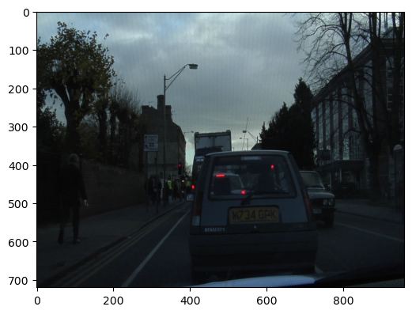
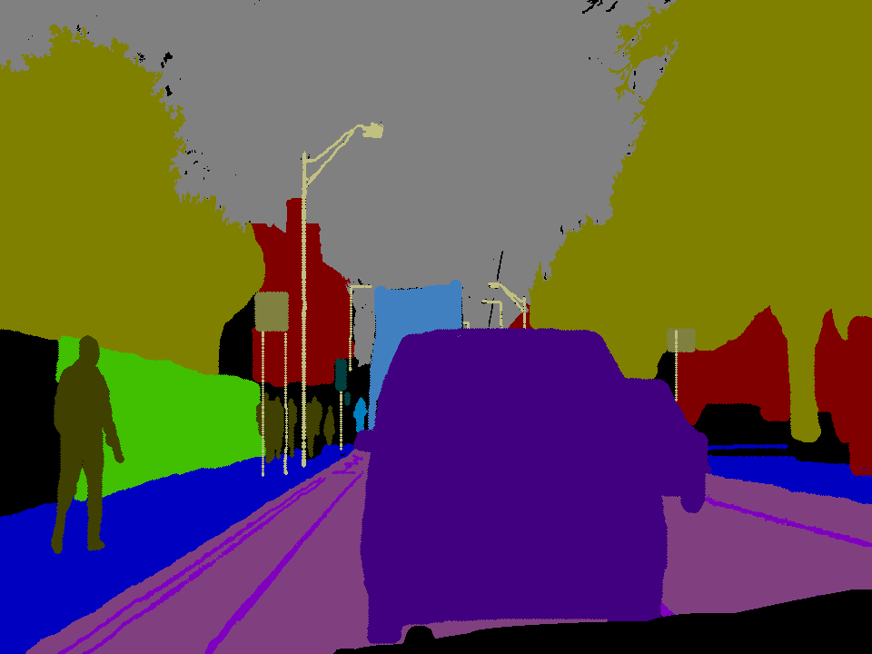

# Unet-Segmentation

This repository contains an implementation of the UNet architecture for image segmentation using TensorFlow. UNet is a popular deep-learning model for image segmentation tasks due to its effectiveness and simplicity.

### Overview
UNet is a convolutional neural network architecture designed for biomedical image segmentation tasks, particularly for segmenting structures in microscopy images such as cell nuclei. This repository provides an implementation of UNet using TensorFlow, which can be trained on custom datasets for various segmentation tasks.

### Dataset
CamVid (Cambridge-Driving Labeled Video Database) dataset is used in both notebooks which is a popular segmentation dataset including images and masks.
<div style="display: flex; justify: center;">
  
  
</div>

### Dependencies
- Python => 3
- TensorFlow => 2
- NumPy
- Matplotlib
- OpenCV (for image preprocessing)

``` 
pip install -r requirements.txt
```

### Usage
To use the UNet model for segmentation, follow these steps:

- Prepare your dataset: Organize your dataset into separate folders for images and corresponding ground truth masks.
- Preprocess your images: Depending on your dataset, you may need to perform preprocessing steps such as resizing, normalization, or augmentation.
- Train the model: Use the provided training script to train the UNet model on your dataset.
- Evaluate the model: After training, evaluate the performance of the trained model on a separate validation set.
